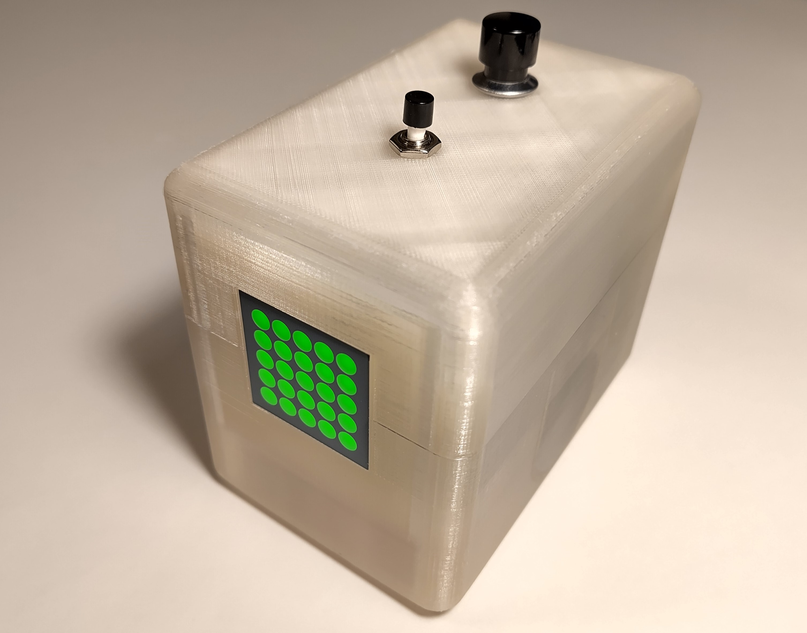
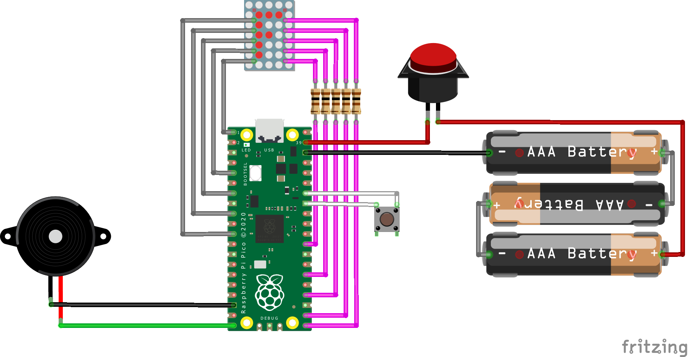
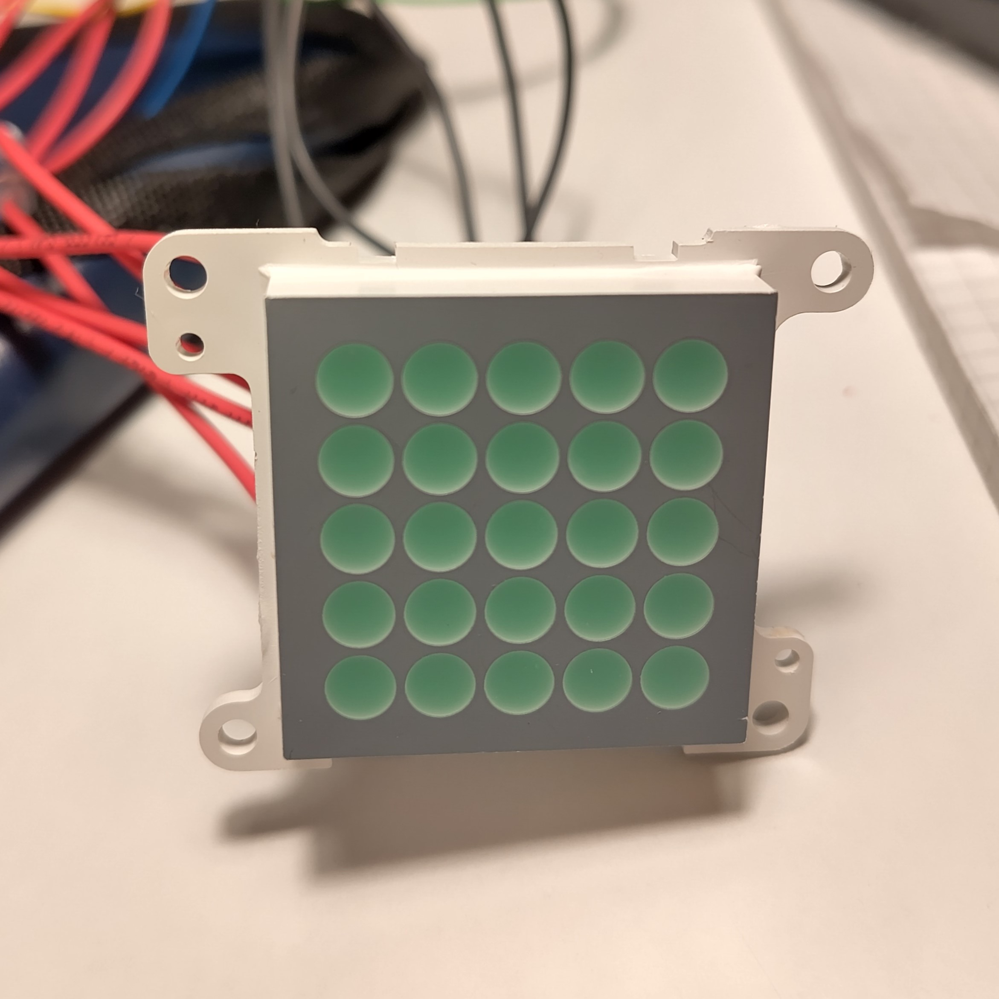
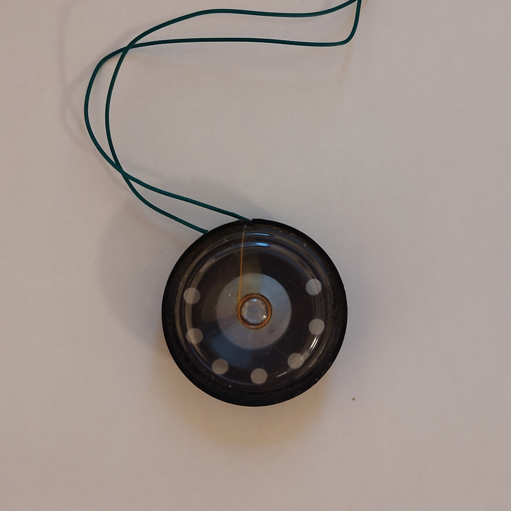
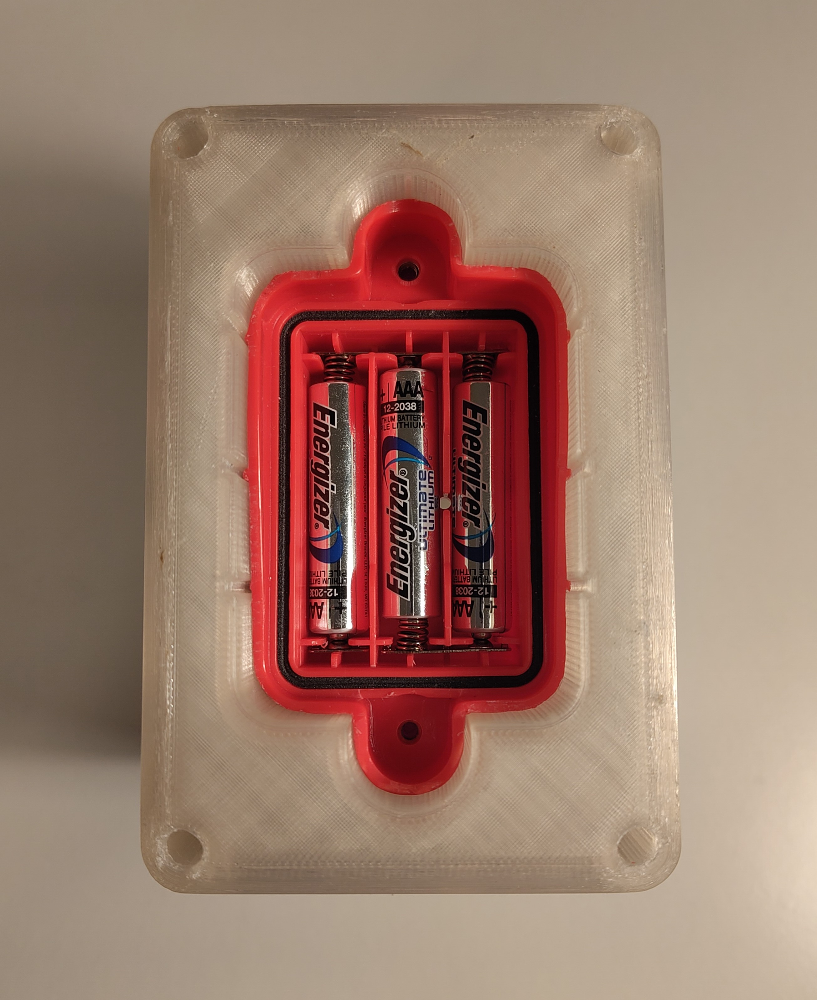
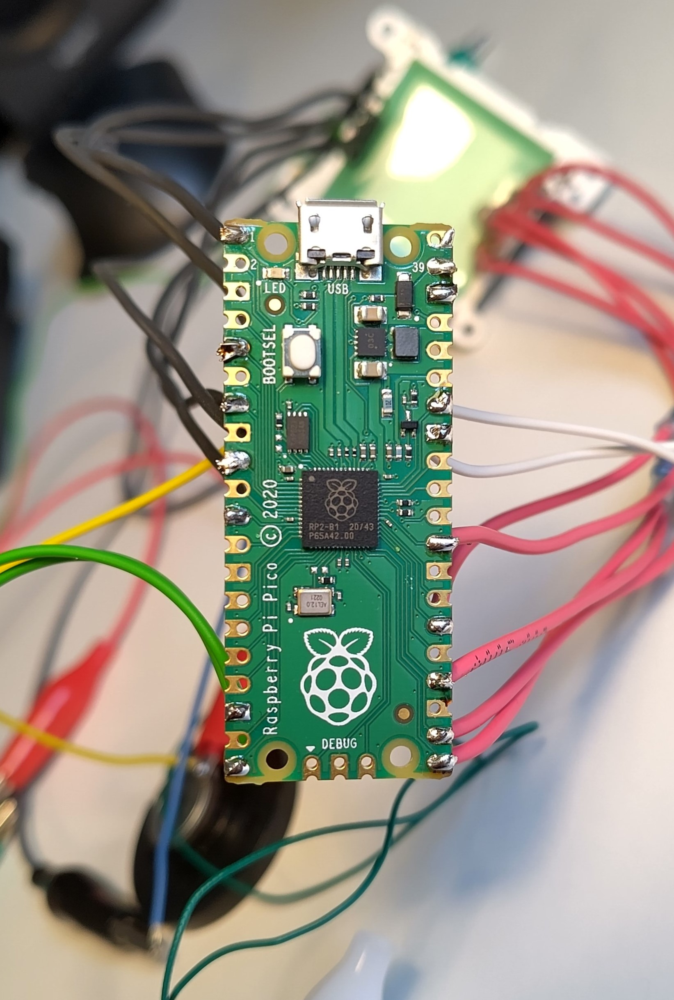
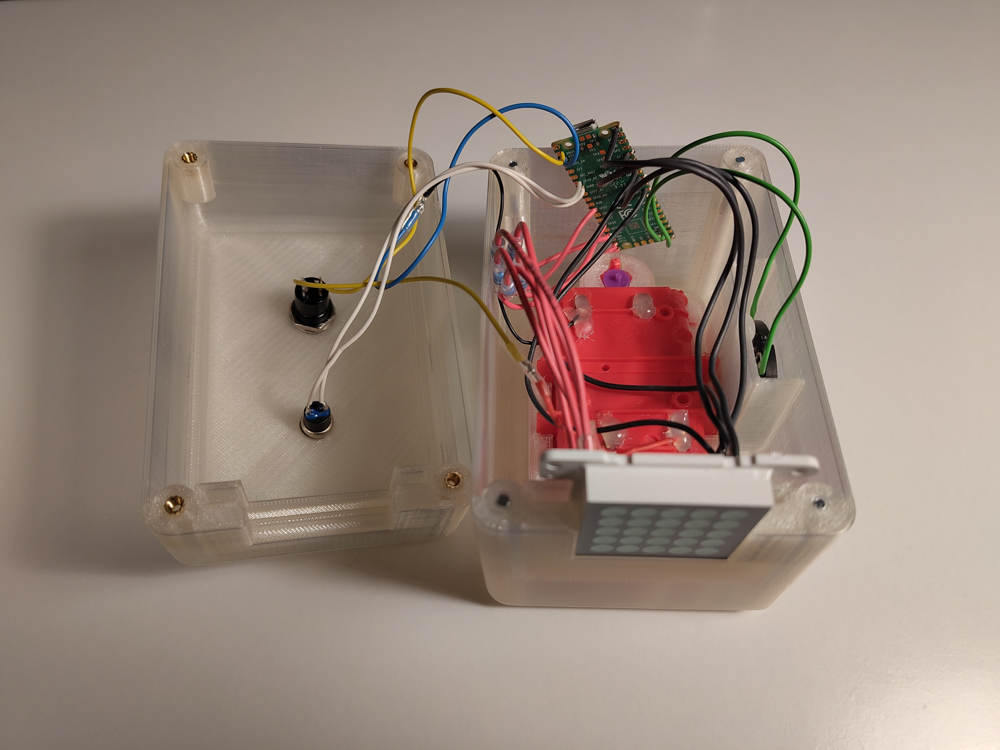
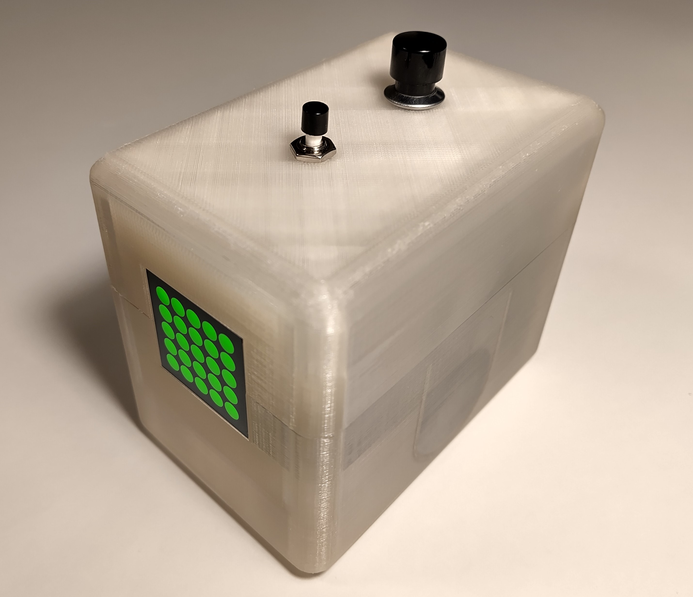

# timer-buzzer
a simple timer with a 5x5 LED matrix and buzzer based on Raspberry Pi Pico

## Software
The Micropython code can be found in `main.py` and relies on the picozero library and [buzzer_music.py](https://github.com/james1236/buzzer_music) written by james1236, a neat code enabling to play songs from [onlinesequencer.net](https://onlinesequencer.net) on a buzzer!

There is only one on/off switch and one button to set the time and reset the timer.

The high speed of the Pi Pico allows muliplexing to show numbers on the LED matrix (controlling LEDs individually even though the LED matrix has only 10 pins - the trick is light up row by row, so fast that it looks to the human eye that all rows would be glowing).

While running the timer, the LED matrix fills up from bottom to top. When the time is elapsed, one of 10 songs plays on the buzzer. The timer is restarted any time upon pressing the button.

## Hardware
* Raspberry Pi Pico
* 5x5 LED matrix with 10 pins
* 5 100 Ohm resistors
* piezo-electric buzzer
* normally closed button
* on/off switch
* 3 AAA batteries
* 3D printed case (.stl files can be found in this repository) with 4 M3 threaded inserts and screws

I was able to salvage the LED matrix, buzzer, and even the battery holder from an old children's toy which used to be a red telephone.

