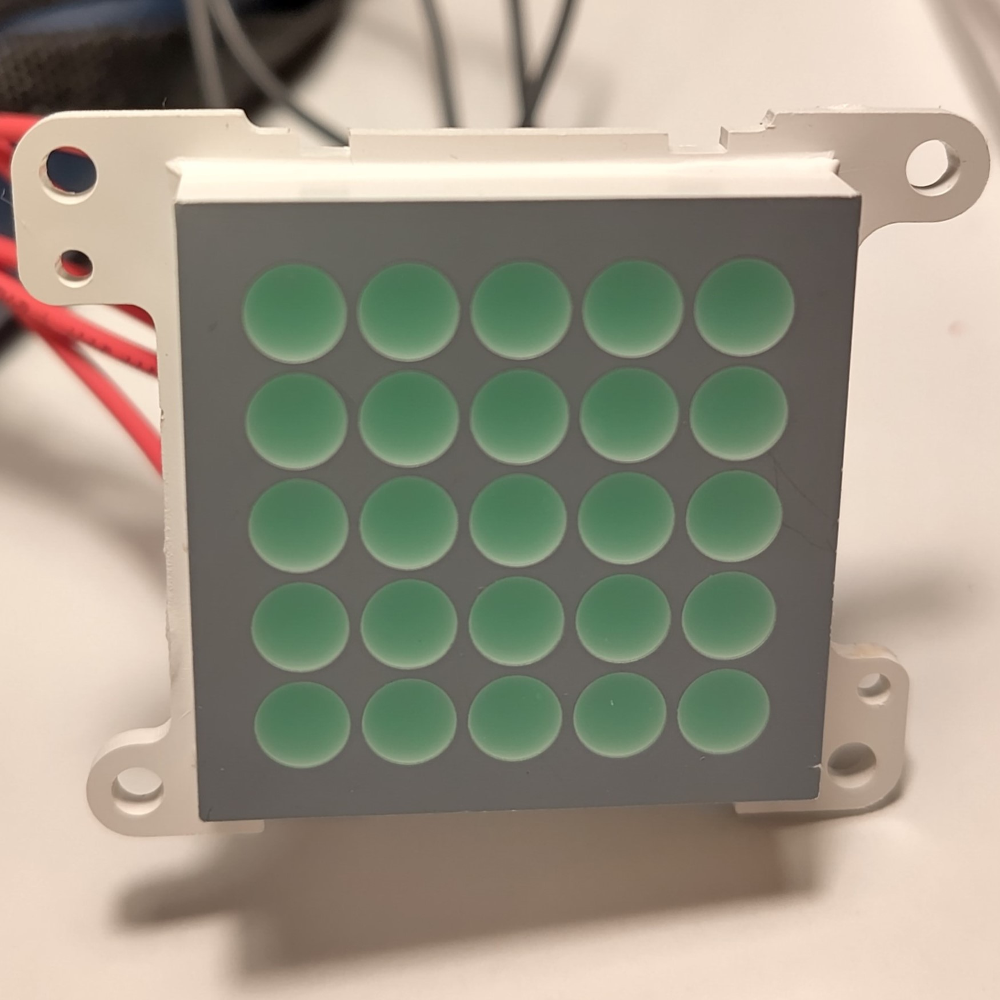

# timer-buzzer
a simple timer with a 5x5 LED matrix and buzzer based on Raspberry Pi Pico

## Software
The Micropython code can be found in `main.py` and relies on the picozero library and [buzzer_music.py](https://github.com/james1236/buzzer_music) written by james1236, a neat code enabling to play songs from [onlinesequencer.net](https://onlinesequencer.net) on a buzzer!

## Hardware
* Raspberry Pi Pico
* 5x5 LED matrix with 10 pins
* 5 100 Ohm resistors
* piezo-electric buzzer
* normally closed button
* on/off (2-state) switch
* 3 AAA batteries
* 3D printed case (.stl files can be found in this repository) with 4 M3 threaded inserts and screws

I was able to source the LED matrix, buzzer, and even the battery holder from an old children's toy which used to be a red telephone.

